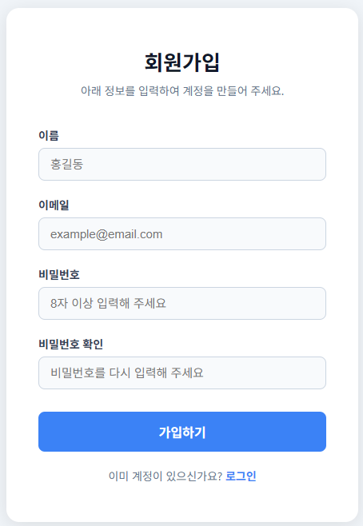
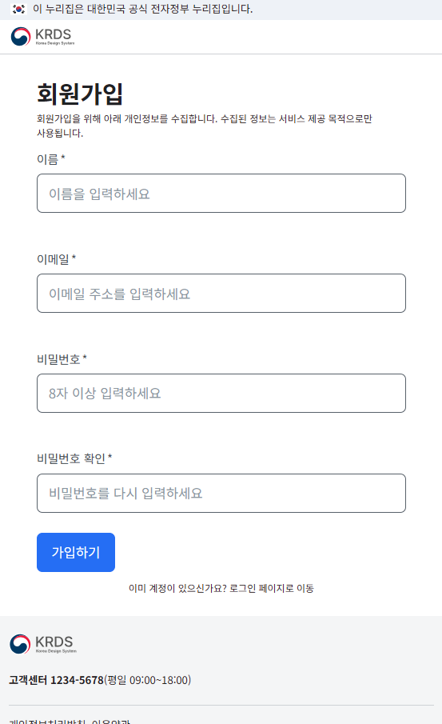

# Eosa — 한국 공공기관 AI 코딩 가이드라인

> Follow the guidelines. Eosa is watching you.

비전공 공무원·공공기관 직원들이 AI로 코딩할 때 정보보안(PIPA), 웹접근성(KWCAG 2.2), 정부 디자인 시스템(KRDS)을 자연스럽게 준수할 수 있도록 돕는 Claude Code 플러그인입니다.

---

## 예시

> 프롬프트: **"회원가입 폼 HTML 페이지 만들어줘"**

| 기본 Claude Code | EOSA 적용 후 |
|:---:|:---:|
|  |  |
| 임의 스타일, KRDS 미사용 | KRDS 컴포넌트·접근성·보안 자동 적용 |

---

## 설계 철학

**Eosa는 "공공기관 가이드라인을 내면화한 개발자"처럼 동작하게 합니다.**

- **코드 작성 시부터 준수**: SQL 파라미터 바인딩, img alt 속성, KRDS 컴포넌트 등을 처음부터 올바르게 작성
- **불확실할 때만 주석**: 위반 여부가 애매할 때만 `# EOSA[도메인]:` 주석으로 표시 (과탐 방지)
- **강제 차단 없음**: 개발 흐름을 방해하지 않고 가이드 제공
- **프로젝트별 설정**: `.eosa/config.json`에 한 번 설정하면 이후 자동 적용

---

## 설치

### 사전 요구사항

- **Node.js** — 훅 실행에 필요
- **Java** — `/eosa-add-guideline`으로 PDF 변환 시 필요 (없어도 나머지 기능은 정상 동작)

### Claude Code

```
/plugin marketplace add baenong/eosa
/plugin install eosa@eosa
```

### 상태표시줄 설정 (선택)

`~/.claude/settings.json`에 추가하면 `[EOSA:보안+접근성+디자인]` 배지를 표시합니다:

```json
{
  "statusLine": {
    "type": "command",
    "command": "bash ~/.claude/plugins/eosa/hooks/eosa-statusline.sh"
  }
}
```

---

## 시작하기

### 1단계: 프로젝트 초기화

프로젝트 디렉토리에서 `/eosa`를 실행하면 적용할 가이드라인을 선택합니다:

```
이 프로젝트에 적용할 공공기관 가이드라인을 선택하세요:

[1] 정보보안 및 개인정보보호 (PIPA) — 필수 권장
[2] 웹접근성 (KWCAG 2.2) — 웹 UI 포함 시 필수
[3] KRDS 디자인 패턴 — 공공기관 서비스 배포 시 권장
[전체] 모두 적용 (권장)
```

선택 후 `.eosa/config.json`과 `CLAUDE.md`가 자동 생성됩니다. **이후 세션부터는 자동으로 활성화됩니다.**

### 2단계: 자동 가이드라인 준수

이후 Claude가 코드를 작성할 때 자동으로 가이드라인을 준수합니다:

```python
# 가이드라인 준수 코드 예시 (자동 적용)
import os
import sqlite3

def get_user(user_id: int):
    conn = sqlite3.connect("users.db")
    cursor = conn.cursor()
    # SQL 파라미터 바인딩 (SEC-2.2 자동 준수)
    cursor.execute("SELECT * FROM users WHERE id = ?", (user_id,))
    return cursor.fetchone()

password = os.environ.get("DB_PASSWORD")  # 환경변수 사용 (SEC-1.2 자동 준수)
```

---

## 명령어

| 명령어                     | 설명                                      |
| -------------------------- | ----------------------------------------- |
| `/eosa`                    | 초기화 (최초) 또는 가이드라인 모드 활성화 |
| `/eosa off`                | 비활성화                                  |
| `/eosa-review`             | 현재 변경사항(git diff) 검토              |
| `/eosa-review src/auth.py` | 특정 파일 검토                            |
| `/eosa-audit`              | 프로젝트 전체 감사                        |
| `/eosa-add-guideline [파일]` | 기관 가이드라인 PDF/MD 자동 변환 및 등록  |
| `/eosa-help`               | 명령어 및 설정 참조                       |

---

## 적용 가이드라인

### [보안] 정보보안 및 개인정보보호 (PIPA)

| Rule ID | 내용                    | 심각도  |
| ------- | ----------------------- | ------- |
| SEC-1.2 | 하드코딩 비밀값 금지    | 🔴 높음 |
| SEC-2.1 | 개인정보 AES-256 암호화 | 🔴 높음 |
| SEC-2.2 | SQL 파라미터 바인딩     | 🔴 높음 |
| SEC-2.3 | XSS 방지                | 🔴 높음 |
| SEC-4.1 | HTTPS 강제              | 🔴 높음 |
| SEC-3.1 | 개인정보 로그 마스킹    | 🟡 중간 |

### [접근성] 웹접근성 KWCAG 2.2

| Rule ID | 내용               | 심각도  |
| ------- | ------------------ | ------- |
| ACC-1.1 | img alt 속성 필수    | 🔴 높음 |
| ACC-2.1 | 키보드 접근성        | 🔴 높음 |
| ACC-3.1 | html lang 속성 필수  | 🔴 높음 |
| ACC-3.5 | form label 연결      | 🔴 높음 |
| ACC-1.8 | 명도대비 4.5:1       | 🟡 중간 |
| ACC-2.2 | 포커스 스타일 유지   | 🔴 높음 |

### [디자인] KRDS 디자인 패턴

| Rule ID | 내용                              | 심각도  |
| ------- | --------------------------------- | ------- |
| DES-0.1 | 프레임워크별 KRDS 패키지 설치     | 🔴 높음 |
| DES-0.2 | KRDS 컴포넌트 사용 (재구현 금지)  | 🔴 높음 |
| DES-0.3 | 커스텀 CSS는 `--krds-*` 토큰 사용 | 🟡 중간 |
| DES-1.3 | 푸터 필수 요소 (로고·저작권·개인정보 처리 방침) | 🟡 중간 |
| DES-6.1 | 입력 필드 label 필수              | 🔴 높음 |
| DES-9.1 | 폼 패턴 (제목·단일 열·필수 표시)  | 🟡 중간 |

---

## 주석 형식

위반이 불확실할 때만 주석을 추가합니다:

```python
# EOSA[보안]: 사용자 입력이 SQL에 직접 포함될 수 있습니다 (Rule ID: SEC-2.2) — 파라미터 바인딩 검토 필요
```

```html
<!-- EOSA[접근성]: img alt 속성 누락 의심 (Rule ID: ACC-1.1) — 이미지 설명 또는 alt="" 추가 -->
```

```css
/* EOSA[디자인]: KRDS 색상 토큰 대신 하드코딩 색상 (Rule ID: DES-0.3) — 색상 토큰 변수 사용 권장 */
```

---

## 설정 파일 (`.eosa/config.json`)

```json
{
  "eosa_version": "0.1.0",
  "schema_version": 1,
  "initialized_at": "2024-01-15T09:30:00Z",
  "active_guidelines": [
    {
      "id": "security-pipa",
      "name": "정보보안 및 개인정보보호",
      "file": "security-pipa.md",
      "version": "2024",
      "mandatory": true
    }
  ],
  "exclude_paths": ["node_modules/", ".venv/", "dist/", "*.min.js"],
  "custom_overrides": {
    "DES-3.2": "disabled"
  }
}
```

`custom_overrides`: 특정 규칙을 비활성화(`"disabled"`)하거나 권고만으로 변경(`"advisory_only"`)합니다.

---

## 새 가이드라인 추가

기관 자체 가이드라인이나 추가 안내서를 등록할 수 있습니다. PDF, Markdown, 텍스트 파일을 지원합니다.

```
/eosa-add-guideline 기관보안지침.pdf
```

인자 없이 실행하면 파일 경로를 직접 묻습니다. 실행하면 자동으로:

1. PDF → Markdown 변환
2. 가이드라인 내용 분석 및 EOSA 규칙 형식으로 변환
3. 변환 결과 확인
4. `guidelines/[id].md` 저장 및 `.eosa/config.json` 등록

등록 후 다음 세션부터 자동으로 적용됩니다.

---

### 플러그인 기본 목록 확장 (개발자용)

`/eosa` 초기화 선택 화면에 새 가이드라인 유형을 추가하려면:

1. `guidelines/` 에 규칙 파일 추가
2. `hooks/eosa-instructions.js`의 `GUIDELINE_SUMMARIES`에 항목 추가
3. `skills/eosa/SKILL.md` Step 2 선택 목록에 항목 추가

---

## 라이선스

MIT © BaeNong
